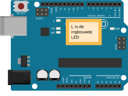

********************************************************************************
::: read

_Introductie_

In deze opdracht wordt uitgelegd hoe je met de cdz-assignment-generator
CoderDojo opdrachten kan maken.

:::

---

::: read

_Over markdown_

Markdown is een eenvoudige opmaaktaal waarmee je tekst kunt structureren en
opmaken met simpele tekens. Het wordt veel gebruikt voor documentatie,
README-bestanden (bijvoorbeeld op GitHub), forums en notities.

Het idee: je schrijft gewone tekst met een paar speciale symbolen, en die
worden omgezet naar mooi opgemaakte tekst (vaak HTML).

(bron: ChatGPT, prompt: "Wat is markdown?")

Zie ook:

- [Markdown Guide](https://www.markdownguide.org/){target=_blank}
- [Cheat sheet](https://www.markdownguide.org/cheat-sheet/){target=_blank}

:::

---

::: read

_Over cdz-assignment-generator_

De CDZ assignment generator is een tool waarmee markdown bestanden eenvoudig
kunnen worden omgezet naar CoderDojo opdrachten in HTML.

Vaak voorkomende blokken kunnen in een bibliotheek worden gezet zodat ze in
meerdere opdrachten kunnen worden gebruikt.

Deze gegenereerde
HTML bestanden zijn geschikt op te kunnen printen over meerdere pagina's. Met
de text \*pagebreak\* kan je ervoor zorgen dat de volgende sectie op een nieuwe
pagina begint.

## voorbeeld

- [markdown](https://raw.githubusercontent.com/coderdojo-zoetermeer/cdz-assignment-generator/refs/heads/main/opdrachten/scratch/scratch.md){target=_blank}
- [HTML](https://coderdojo-zoetermeer.github.io/cdz-assignment-generator/scratch/scratch.html){target=_blank}

:::

---

::: read

_Over blokken_

Hieronder worden de blokken verder uitgelegd.

:::

---

::::: read

_read-blok uitleg_

Een read-blok is een blokje text waarin uitleg wordt aan de leerling. Probeer
deze blokjes klein te houden en begin elk blokje met een kopje waaruit
duidelijk wordt wat er wordt uitgelegd, zodat de leerling kan bepalen of
leerling het blokje moet lezen of hen het wil lezen.

:::: demo

::: read

_Titel read blok_

Tekst Read blok.

:::

::::

:::::

---

::::: read

_programmeer-blok uitleg_

Een programmeer-blok wordt gebruik om aan te duiden dat de leerling iets moet
programmeren. In programmeerblokken kan je stukjes code toevoegen. Deze worden
automatisch opgemaakt met syntax highlights.

:::: demo

::: program

_Titel programmeer blok_

Tekst programmeerblok.

```py

print('Hello world!')

```

:::

::::

:::::

---

::::: read

_build-blok uitleg_

Een build wordt gebruikt om aan te duiden dat de leering iets moet doen. Dit
is met name van toepassing voor Arduino opdrachten. bijvoorbeeld voor het
bouwen van een elektronische schakeling.

:::: demo

::: build

_Titel build blok_

Tekst build-blok.

:::

::::

:::::

---

:::: read

_gebruik van images_

Je kan eenvoudig plaatjes aan blokken toevoegen. Ook is het mogelijk plaatjes
naar links of rechts te laten "floaten" zodat de tekst er automatisch omheen
wordt weergegeven. De plaatjes kan je ergens in de directory structuur van
de opdracht plaatsen. Linken naar plaatjes die online staan is ook mogelijk.

Met het element \*clear-float\* kan je ervoor zorgen dat de tekst erna weer
onder het plaatje wordt weergegeven en dus niet ernaast.
(Zie ook: [CSS](https://developer.mozilla.org/en-US/docs/Web/CSS/Reference/Properties/clear))

::: demo Plaatjes

---

{.float-right}
Het plaatje hiernaast wordt met de style float-right weergegeven.

---

_clear-float_

{.float-left}
Het plaatje hiernaast wordt met de style float-left weergegeven.

---

_clear-float_

Het plaatje hieronder wordt zonder float weergegeven.


_clear-float_

:::

::::

---

::::: read

_verwijzen naar standaard opdracht blokken_

Vaak voorkomende elementen kunnen in een bibliotheek worden beheerd zodat ze
eenvoudig kunnen worden hergebruikt. Hieronder een voorbeeld van het gebruik
van het standaard element voor de uitleg van de modulo functie. Hier kan zelfs
worden aangegeven in welke programmeertaal de uitleg moet worden gegeven.

```md
 <!-- @include: global-lib/explain-mod.md#scratch -->
```

wordt in Scratch:

<!-- @include: global-lib/explain-mod.md#scratch -->

voor arduino:

```md
 <!-- @include: global-lib/explain-mod.md#arduino -->
```

<!-- @include: global-lib/explain-mod.md#arduino -->

:::::
