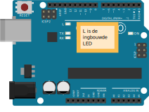

[[TOC]]

********************************************************************************

# Handleiding

In dit document wordt uitgelegd hoe je met de cdz-assignment-generator
CoderDojo opdrachten kan maken.

# Over cdz-assignment-generator

De CDZ assignment generator is een tool waarmee markdown bestanden eenvoudig
kunnen worden omgezet naar CoderDojo opdrachten in HTML.

Vaak voorkomende blokken kunnen in een bibliotheek worden gezet zodat ze in
meerdere opdrachten kunnen worden gebruikt.

Deze gegenereerde
HTML bestanden zijn geschikt op te kunnen printen over meerdere pagina's. Met
de text `*pagebreak*` kan je ervoor zorgen dat de volgende sectie op een
nieuwe pagina begint.

Een voorbeeld van een opdracht die is gemaakt met deze generator is Kat Race.

- [Opdracht Kat race](https://coderdojo-zoetermeer.github.io/cdz-assignment-generator/scratch/cat-race/cat-race.html){target=_blank}
- [Broncode](https://github.com/coderdojo-zoetermeer/cdz-assignment-generator/blob/main/opdrachten/scratch/cat-race/cat-race.md?plain=1){target=_blank}

# Gebruik

Voor instructie over installatie en gebruik van de cdz-assignment-generator
zie [README.md](https://github.com/coderdojo-zoetermeer/cdz-assignment-generator/blob/main/README.md)

# Over markdown

Markdown is een eenvoudige opmaaktaal waarmee je tekst kunt structureren en
opmaken met simpele tekens. Het wordt veel gebruikt voor documentatie,
README-bestanden (bijvoorbeeld op GitHub), forums en notities.

Het idee: je schrijft gewone tekst met een paar speciale symbolen, en die
worden omgezet naar mooi opgemaakte tekst (vaak HTML).

(bron: ChatGPT, prompt: "Wat is markdown?")

Zie ook:

- [Markdown Guide](https://www.markdownguide.org/){target=_blank}
- [Cheat sheet](https://www.markdownguide.org/cheat-sheet/){target=_blank}

--------------------------------------------------------------------------------

# Over blokken

Blokken worden gebruikt om opdrachten op te delen in stukken. Bij het printen
van een opdracht worden een page-break binnen een blok automatisch vermeden.

## read-blok

Een read-blok is een blokje text waarin uitleg wordt aan de leerling. Probeer
deze blokjes klein te houden en begin elk blokje met een kopje waaruit
duidelijk wordt wat er wordt uitgelegd, zodat de leerling kan bepalen of
leerling het blokje moet lezen of hen het wil lezen.

```md{.markdown-example}

::: read

*Titel read blok*

Tekst Read blok.

:::

```

::: read

*Titel read blok*

Tekst Read blok.

:::

## programmeer-blok

Een programmeer-blok wordt gebruik om aan te duiden dat de leerling iets moet
programmeren. In programmeerblokken kan je stukjes code toevoegen. Deze worden
automatisch opgemaakt met syntax highlights.

````md{.markdown-example}
::: program

*Titel programmeer blok*

Tekst programmeerblok.

```py
  print('Hello world!')
```
:::

````

::: program

*Titel programmeer blok*

Tekst programmeerblok.

```py
print('Hello world!')

```

:::

## build-blok

Een build wordt gebruikt om aan te duiden dat de leering iets moet doen. Dit
is met name van toepassing voor Arduino opdrachten. bijvoorbeeld voor het
bouwen van een elektronische schakeling.

```md{.markdown-example}
::: build

*Titel build blok*

Tekst build-blok.

:::
```

::: build

*Titel build blok*

Tekst build-blok.

:::

## uitdaging-blok

Een uitdaging-blok wordt gebuikt om de Ninja een extra uitdaging te geven.

```md{.markdown-example}
::: challenge

*Titel uitdaging blok*

Tekst uitdaging-blok.

:::
```

::: challenge

*Titel uitdaging blok*

Tekst uitdaging-blok.

:::

# Gebruik van images

Je kan eenvoudig plaatjes aan blokken toevoegen. Ook is het mogelijk plaatjes
naar links of rechts te laten "floaten" zodat de tekst er automatisch omheen
wordt weergegeven. De plaatjes kan je ergens in de directory structuur van
de opdracht plaatsen. Linken naar plaatjes die online staan is ook mogelijk.

Met het element `*clear-float*` kan je ervoor zorgen dat de tekst erna weer
onder het plaatje wordt weergegeven en dus niet ernaast.
(Zie ook: [CSS](https://developer.mozilla.org/en-US/docs/Web/CSS/Reference/Properties/clear))

::: demo Plaatjes demo

{.float-right}
Het plaatje hiernaast wordt met de style float-right weergegeven.

*clear-float*

{.float-left}
Het plaatje hiernaast wordt met de style float-left weergegeven.

*clear-float*

Het plaatje hieronder wordt zonder float weergegeven.


*clear-float*

:::

--------------------------------------------------------------------------------

# Verwijzen naar standaard opdracht blokken

Vaak voorkomende elementen kunnen in een bibliotheek worden beheerd zodat ze
eenvoudig kunnen worden hergebruikt. Hieronder een voorbeeld van het gebruik
van het standaard element voor de uitleg van de modulo functie. Hier kan zelfs
worden aangegeven in welke programmeertaal de uitleg moet worden gegeven.

```md{.markdown-example}
 <!-- @include: global-lib/explain-mod.md#scratch -->
```

wordt in Scratch:

<!-- @include: global-lib/explain-mod.md#scratch -->

voor arduino:

```md{.markdown-example}
 <!-- @include: global-lib/explain-mod.md#arduino -->
```

<!-- @include: global-lib/explain-mod.md#arduino -->

# Fontawesome iconen

Het is mogelijk om iconen uit de fontawesome bibliotheek toe te voegen.

De link [font awesome](https://fontawesome.com/search?ic=free-collection){target=_blank}
verwijst naar een site met de collectie van iconen. Alleen de gratis iconen
zijn beschikbaar. De PRO iconen dus niet.

Hieronder enkele voorbeelden van de syntax:

`::<familie> <naam> =<grootte> /<kleur>::`

familie, naam en grootte zijn optioneel.

*Voorbeelden:*

| Markdown                         | Voorbeeld                      |
|:---------------------------------|:-------------------------------|
| `::solid computer =30::`         | ::solid computer =30::         |
| `::solid robot =30::`            | ::solid robot =30::            |
| `::solid microchip =30::`        | ::solid microchip =30::        |
| `::solid microchip =30 /green::` | ::solid microchip =30 /green:: |
| `::microchip::`                  | ::microchip::                  |

# Signaaltekst

Je kan teksten als volg accentueren.

```md{.markdown-example}
>[!belangrijk]
>Belangrijk ....
```

>[!belangrijk]
>Belangrijk ....

```md{.markdown-example}
>[!notitie]
>Notitie ...
```

>[!notitie]
>Notitie ...

```md{.markdown-example}
>[!tip]
>Tip ...
```

>[!tip]
>Tip ...

```md{.markdown-example}
>[!waarschuwing]
>Waarschuwing ...
```

>[!waarschuwing]
>Waarschuwing ...

```md{.markdown-example}
>[!voorzichtig]
>Voorzichtig ...
```

>[!voorzichtig]
>Voorzichtig ...
