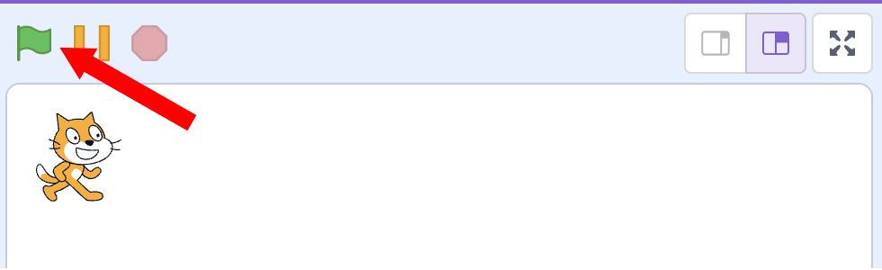
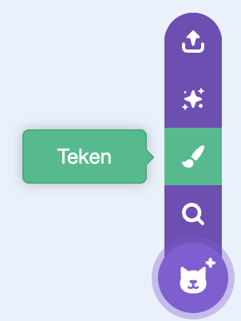

********************************************************************************

::: read

*Introductie*

In deze opdracht ga je een spel maken die als doel heeft de kat zo snel mogelijk
naar de overkant te laten lopen.

:::
________________________________________________________________________________
::: program

{.selected-sprite}
*begin van de opdracht*

@flexs gap-x-5

@flex

::regular hand-point-right =30::

@flex

Ga naar de
-sprite en maak de kat kleiner. Zet de grootte
op 50.

@flex


@end

:::

________________________________________________________________________________

::: program

{.selected-sprite}
*Zet kat links*

@flexs gap-x-5

@flex

::regular hand-point-right =30::

@flex

Als het spelletje start () moet de kat
links van het scherm staan. Gebruik de codeblokken hiernaast om dit mogelijk
te maken.

@flex

```scratch
Wanneer groene vlag wordt aangeklikt
maak x (-200)
```

@end

:::

________________________________________________________________________________

<!-- @include: global-lib/explain-axis.md#x-as-scratch -->

________________________________________________________________________________

::: program

{.selected-sprite}
*De kat laten bewegen*

We willen de kat iedere keer een stukje naar voren laten bewegen als we op de
spatiebalk drukken, dit kunnen we met de volgende extra codeblokken.

@flexs gap-x-5

@flex

::regular hand-point-right =30::

@flex

Voeg de blokken die hiernaast staat aangewezen toe aan de code
van .

@flex

```scratch
wanneer groene vlag wordt aangeklikt
maak x (-200)

wanneer [spatiebalk v] is ingedrukt // ++++++
neem (10) stappen // ++++++

```

@end

@flexs gap-x-10

::regular hand-point-right =30::

@flex

Probeer het uit:

- Start het programma door op de groene vlag te klikken.
- Druk een paar keer op de spatiebalk.
- Start het programma opnieuw door op de groene vlag te klikken.
- Houd de spatiebalk ingedrukt.

Snap je hoe het werkt?

@flex



@end

:::

________________________________________________________________________________

<!-- @include: global-lib/explain-events.md#scratch -->

________________________________________________________________________________

::: program

{.selected-sprite}
*Niet vals spelen!*

Om te voorkomen dat je makkelijk aan de overkant komt, willen we wachten nadat
de spatiebalk is ingedrukt, dat hij eerst weer is los gelaten.

@flexs gap-x-5

@flex

::regular hand-point-right =30::

@flex

Pas de code van  aan zoals hiernaast
is weergegeven.

@flex

```scratch
wanneer [spatiebalk v] is ingedrukt
neem (10) stappen
wacht tot <niet <toets (spatiebalk v) ingedrukt>> // ++++++
```

@end

*clear-float*

>[!tip]
>Kijk goed naar de kleuren!
>
>Je moet de blokken in elkaar schuiven!
>
> - Het blok `wacht tot <>`{.scratch} vind je in de `Besturen` lijst
> - Het blok `niet <>`{.scratch} vind je in de `Functies` lijst
> - Het blok `toets [spatiebalk v] ingedrukt?`{.scratch} vind je in
>   de `Waarnemen` lijst

:::

________________________________________________________________________________

::: program

{.selected-sprite}
*Een finishlijn toevoegen*

*clear-float*
@flexs gap-x-5

@flex

::regular hand-point-right =30::

@flex

Maak een nieuwe Sprite (plaatje) aan en teken hier een finishlijn in.

@flex



@flex


@end

:::

________________________________________________________________________________

::: program

{.selected-sprite}
*Spel laten stoppen als kat bij de finish is*

<!--  -->

Als de kat nu bij de finish lijn komt moet ons spel stoppen. Dit kan je met de
volgende code blokken doen.

@flexs gap-5

@flex

::regular hand-point-right =30::

@flex

Voeg de codeblokken toe aan 

Dit zorgt ervoor dat  `Ik ben er!!!` zegt als hij
`Sprite 2` raakt. `Sprite 2` is de sprite voor de
finishlijn.

@flex

```scratch
wanneer [spatiebalk v] is ingedrukt
neem (10) stappen
wacht tot <niet <toets (spatiebalk v) ingedrukt>>
als <raak ik (sprite2 v) ?> dan // ++++++
  zeg [ik ben er!!!] (2) sec. // ++++++
  stop [alle v] // ++++++
end
```

@end

:::

________________________________________________________________________________

<!-- @include: global-lib/explain-variabele.md#scratch -->

________________________________________________________________________________

::: program

{.selected-sprite}
*Maken variabele voor het bijhouden van de tijd*

Dit is een Race! dus moeten we de tijd bij gaan houden hoelang
 erover doet.

We hebben hiervoor een variabele nodig met de naam `tijd`. In de
uitleg over variabelen staat hoe dit moet.

@flexs flex-cols-12 gap-x-10

@flex col-span-1

::regular hand-point-right =30::

@flex col-span-5

Maak nu zelf een variabele met de naam tijd.

@flex col-span-6


@end

:::

________________________________________________________________________________

::: program

{.selected-sprite}
*De tijd bijhouden*

@flexs gap-x-5

@flex

::regular hand-point-right =30::

@flex

Nu moeten we er eerst voor zorgen dat de tijd op nul wordt gezet als je het
programma start.

@flex

```scratch
wanneer groene vlag wordt aangeklikt
maak x (-200)
maak [tijd v] (0) // +++++
```

@end

@flexs

@flex

::regular hand-point-right =30::

@flex

Zorg er nu voor dat de variable `tijd` elke seconde met 1 wordt
verhoogt.

@flex

```scratch
wanneer groene vlag wordt aangeklikt
maak x (-200)
maak [tijd v] (0)
herhaal // +++++
  wacht (1) sec. // +++++
  verander [tijd v] met (1) // +++++
end

```

@end

:::

________________________________________________________________________________

::: program

{.selected-sprite}
*Score en tijd laten zien*

@flexs gap-x-5

@flex

::regular hand-point-right =30::

@flex

We gaan er nu voor zorgen dat je de score ziet als 
bij de finish komt.

De tijd meten in hele seconden is misschien niet zo leuk. Laten we de tijd
in 1/10 van een seconde gaan meten.

We willen dus de variabele tijd niet 1x per seconde verhogen, maar 10x
per seconde. Pas de code aan zoals hiernaast is weergegeven.

@flex

```scratch
wanneer groene vlag wordt aangeklikt
maak x (-200)
maak [tijd v] (0)
herhaal 
  wacht (0.1) sec. // < aanpassen
  verander [tijd v] met (1)
end

@end

@flexs gap-x-5

@flex

::regular hand-point-right =30::

@flex

Als  bij de finish komt moet hij zijn tijd zeggen.

@flex

```scratch
wanneer [spatiebalk v] is ingedrukt
neem (10) stappen
wacht tot <niet <toets (spatiebalk v) ingedrukt>>
als <raak ik (sprite2 v) ?> dan 
  zeg (voeg [mijn tijd is] en (tijd) samen) (2) sec. // < aanpassen
  stop [alle v]
end
```

@end

:::

________________________________________________________________________________

::: program

{.selected-sprite}
*Hindernissen*

Laten we het wat moeilijker maken en een hindernis op de weg van de kat zetten.

@flexs gap-x-5

@flex

::regular hand-point-right =30::

@flex

Dit kan je doen door Kies een sprite. Kies een leuk plaatje uit en
maak het plaatje ook weer wat kleiner, bijvoorbeeld weer grootte 50

@flex


@end

@flexs gap-x-5

@flex

::regular hand-point-right =30::

@flex

Nu moeten we ervoor zorgen dat als  de hindernis
aanraakt (de bananen) dat de kat weer terug word gezet aan het begin van het
spel. Dat kan je met de volgende commando blokken doen

@flex

```scratch
wanneer [spatiebalk v] is ingedrukt
neem (10) stappen
wacht tot <niet <toets (spatiebalk v) ingedrukt>>
als <raak ik (sprite2 v) ?> dan
  zeg (voeg [mijn tijd is] en (tijd) samen) (2) sec.
  stop [alle v]
end
als <raak ik (bananas v)?> dan //+++++
  maak x (200) //+++++
end
```

@end

:::

________________________________________________________________________________

<!-- @include: global-lib/explain-axis.md#y-as-scratch -->

________________________________________________________________________________

::: program

{.selected-sprite}
*Omhoog bewegen*

Nu moeten we het wel mogelijk maken voor de kat om de hindernis te ontwijken.
Dit kunnen we doen door de kat omhoog en omlaag te laten gaan. Gebruik pijltje
omhoog om de kat om hoog te laten gaan. De Y Positie van de kat bepaald hoe
hoog de kat staat.

@flexs gap-x-5

@flex

::regular hand-point-right =30::

@flex

Maak de blokken hiernaast

@flex

```scratch
wanneer [pijltje omhoog v] is ingedrukt // +++++
verander y met (10) //  +++++
```

@end

:::

________________________________________________________________________________

::: program

{.selected-sprite}
*Omlaag bewegen*

@flexs gap-x-5

@flex

::regular hand-point-right =30::

@flex

Maak zelf een blok om de kat omlaag te laten bewegen als op pijltje omlaag
wordt gedrukt.

@end

:::

________________________________________________________________________________

::: program

{.selected-sprite}
*Y positie op 0 zetten bij het begin*

Als het spel begint moet  op y-positie 0 staan.

@flexs gap-x-5

@flex

::regular hand-point-right =30::

@flex
Voeg het blok dat hiernaast staat toe aan je programma. Je moet zelf bepalen
waar hij moet komen.

@flex

```scratch
maak y (0)
```

@end

@flexs gap-x-5

@flex

::regular hand-point-right =30::

@flex

Speel het spel en kijk of alles werkt.

@end

:::

________________________________________________________________________________

::: challenge

*Extra hindernissen*

@flexs gap-x-5

@flex

::regular hand-point-right =30::

@flex

{.float-right}
Maak meerdere hindernissen door rotsen toe te voegen.

@end

@flexs gap-x-5

@flex

::regular hand-point-right =30::

@flex

Zorg er voor dat als de kat tegen
de hindernissen aanloopt hij altijd
weer terug links word geplaatst!

@end

:::

________________________________________________________________________________

::: challenge

*Langzamer lopen*

@flexs gap-x-5

@flex

::regular hand-point-right =30::

@flex

Laat de kat langzamer lopen, dus dat je nog veel vaker op de spatiebalk moet
drukken om bij de finish te komen.

- Met hoeveel stappen per keer loopt de kat nu?
- Moet je het aantal stappen hoger of lager maken om de kat langzamer
  te laten lopen?

@end

:::

________________________________________________________________________________

::: challenge

*Twee spelers*

Kan je dit een 2-speler spel maken?

@flexs gap-x-5

@flex

::regular hand-point-right =30::

@flex

Maak naast de kat een andere speler in je spel.
Kopieer de code van de kat naar de andere speler.

@end

@flexs gap-x-5

::regular hand-point-right =30::

@flex

Verander de toetsen voor de spelers

- Kat (Speler 1)

  - Vooruit : Z
  - Omhoog: S
  - Omlaag: X

- Speler 2
  - Vooruit: N
  - Omhoog: K
  - Omlaag: M

@end

@flexs gap-x-5

@flex

::regular hand-point-right =30::

@flex

Als de 2 spelers elkaar aanraken, zet dan beide spelers terug aan het begin!

@end

:::

________________________________________________________________________________

::: read

*Voorbeeld spel programma*

[Download](./assets/cat-race.sb3)


:::
